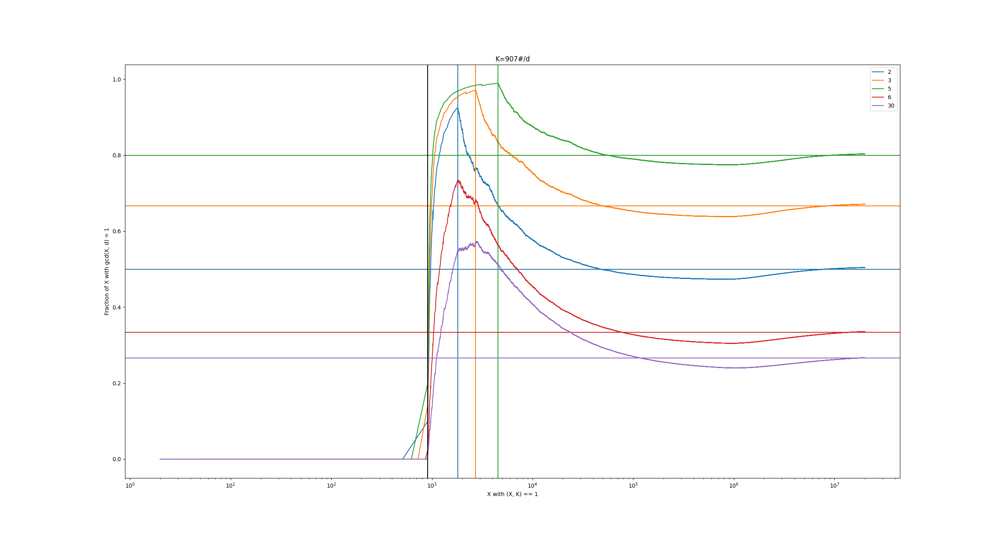
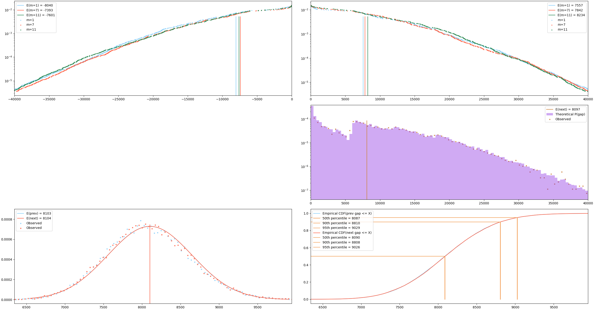
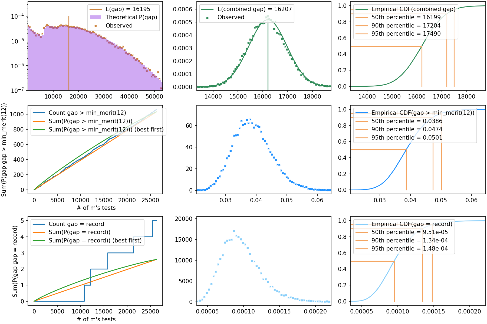

# Table of Contents

- [Theory](#Theory)
  * [`combined_sieve`](#combined_sieve)
    * [`--sieve_length`](#--sieve_length)
    * [Optimizing choice of D](#optimizing-choice-of-d)
    * [Skipped PRP Tests](#skipped-prp-tests)
    * [One Sided Tests](#one-sided-tests)
  * [`gap_stats`](#gap_stats)
  * [Choosing `--top-x-percent`](#choosing---top-x-percent)
  * [Out of order testing](#out-of-order-testing)
  * [`missing gaps`](#missing_gaps)

# Theory

Information and experimental validation that doesn't fit in [README.md](README.md)

## `combined_sieve`

### `--sieve_length`

`combined_sieve` autosets `--sieve_length` (SL) if not passed.

This section abbreviates gcd(a, b) = c as (a, b) = c

1. Finds SL such that `prob_prime ** |{i | (K, i) = 1, -SL < i < SL}|` is < 0.008
    * `prob_prime ** goal_coprime < 0.008` ⇔ `goal_coprime > log(0.008, prob_prime)`
1. `prob_prime` is improved be adjusted for sharing no factor with K
  1. `prob_prime ≈ (1 / log(m * K)) / Prod(1 - 1/p, p <= P)`
1. Over all `0 <= mi < M_inc` find
  ```python
      min(len(i for i in range(-SL, SL) if math.gcd(m * K + i, K) == 1)
          for m in range(M_start, M_start+M_inc) if math.gcd(m, D) == 1)
  ```
  1. Because D often includes many small factors can improve accuracy by also handling factor of D
    1. **Approximated** by replacing `m` with `m % D`
    1. Check `math.gcd((m % D) * K + i, K*D) == 1`
1. Check if `min(...) >= goal_coprime`
  1. Expensive to calculate so use these optimizations
      * Cache `len(i for i in range(-SL+1, SL) if (m * K + i, K*D) == 1)`
      * `((m % D) * K + i, K*D) > 1` implies `(i, K) > 1 or ((m % D) * (K % D) + i, D) > 1`
      * if `(i, K) > 1` advance to next (all `m * K + i` will be coprime)
      * All (m % D) have same count, so only consider m with (m, d) == 1

### Optimizing Choice of D

Not all `d` are created equal. Many `d` increase the average gap non-trivially.
Anecdotally choosing a small primorial (`11#` or `7#`) is quite common.

To understand why look at the estimation of unknowns.
The naive estimation of unknowns (numbers not removed by small primes) has 3 parts.

1. Primes `pk` which divide `K`
2. Primes `pd` which divide `d` (note `pd` must be less than `P` from `P#`)
3. Primes up to `--max-prime`

---

1. Primes of the first category are the most easy to handle.

`pk | m * K + X` ⇔ `pk | (pk, m * K + X)` and `(pk, m * K + X) = (pk, X)`
So only `X` with `gcd(X, K) == 1` need to be considered. (This is the `coprime_count` in `--method2`)

2. Primes of the second category (generally only a handful of primes) are handled per m.

For each `m`, find a multiple of `pd` and mark off other multiple of `pd`

By making `d` a multiple of 2 `count_coprime` decreases by a factor of 2.
Non-intuitively the number of odd/even coprime X is not always close to 50%.

For `1 <= X <= P` all X will be composed of factors of `d` (meaning mostly divisible by `pk`)

For `P <= X <= P * pd`, `pd | X` implies `X/pd <= P` which can only be true if `X/pd` is composed of only factors of `d`
So most numbers on this interval WILL NOT be divisible by `pd` (see [SL_factors_of_d.py](misc/SL_factors_of_d.py))

For `X >= P * pd` initially there will be more X divisible by `pd` then expected (`1/pd`) then a trend towards the expected count.

This is illustrated by 

X divisible by `pd` is BAD because `pd | X, (K, pd) = 1, (m, pd) = 1` implies `(m * K + X, pd) = (m * K, pd) = 1`

So the larger percent of X NOT divisible by `pd` the larger chance of `m * K + X` being divisible by `pd`

3. Finally the larger small primes, `p`, seem to behavior normally and divide ~1 in p of the remaining X.

We can estimate what percent of numbers will be removed by using
[Mertens 3rd theorem](https://en.wikipedia.org/wiki/Mertens%27_theorems)

---

Notice from the graph that each of the individual factors `dp` might have a deficientcy of divisibilty
but the product `d` will still have excess of divisibility (see `d=30` near `8*10^4`)

In the end the best advice is to try to minimize avg factors / m OR maximize expected gap (from `gap_stats`).


### Skipped PRP Tests

Given `m * K` and a prime limit how many PRP tests to find the next/previous prime?

* `prob_prime(X) ≈ 1 / log(X)`
  * This result is due to the [Prime Number Theorum](https://en.wikipedia.org/wiki/Prime_number_theorem)
  * This approximates `prob_prime(random.randint(2, X))`, not `prob_prime(X)`
* A Better estimate is given by `prob_prime(X) ≈ (log(X) - 1) / log(X)^2`
  * `prob_prime(X) ≈ 1/log(X) - 1/log(X)^2`

Accounting for no small prime factors

* Let `prob_p = 1/log(m * K) - 1/log(m * K)^2` be the probability with no information
* Adjust for all the primes we know don't divide it `prob_p / Prod(1 - 1/p, p <= P_limit)`
  * Mertens' third theorem gives very tight approx of `Prod(1 - 1/p, p <= P_limit)`
* `prob_prime ≈ prob_p / (1  / (log(P_limit) * exp(GAMMA)))`
* `prob_prime ≈ prob_p * log(P_limit * exp(GAMMA))`

How many expected tests to find the next prime? one over the probability of prime.

* `E(test) = 1 / prob_prime`

As `P_limit` increases calculate how many fewer expected tests will be performed.

```python
def ExpectedTests(test, m * K, old_limit, new_limit):
        GAMMA = 0.57721566
        prob_p = 1 / log(m * K) - 1 / log(m * K) ** 2
        # 1 / (prob_p * log(old_limit) * exp(GAMMA)) - 1 / (prob_p * log(new_limit) * exp(GAMMA)
        return 1 / (prob_p * math.exp(GAMMA)) * (1/math.log(old_limit) - 1/math.log(new_limit))
```


### One Sided Tests

Given many `m_n` and `prob_record`.

If `prev_prime` is "small" don't waste time on `next_prime` only to be disappointed by small gap.

Calculate `new_prob_record` taking into account `prev_prime` result.

Simple math says `prob_record` takes 2 "time" to test, if `new_prob_record < 0.5 * prob_record` then skip.

Better analysis says with skipping test more than `prob_record/2` each "time". Let `prob_processed / one sided test` be the average of (`prob_record - new_prob_record` if skip else `prob_record`/2). This is the rate (including skips) `prob_record` is tested at. If `new_prob_record` is less then skip.

In practice `one side skips` is often as high as 90% and the prob record rate is `0.8 * prob / side` for a `0.8 / 0.5 =` 60% speedup!

#### Experimental evidence

Sieve a range to multiple depths (100M, 200M, ... 3B, 4B)

```bash
$ make combined_sieve DEFINES=-DSAVE_INCREMENTS
$ time ./combined_sieve --unknown-filename 1_1009_210_2000_s7000_l4000M.txt --save-unknowns

100,000,007 (primes 2,760,321/5,761,456)	(seconds: 0.99/3.1 | per m: 0.0067)
	~ 2x 29.22 PRP/m		(~ 1046.7 skipped PRP => 1013.7 PRP/seconds)

200,000,033 (primes 5,317,482/11,078,938)	(seconds: 1.81/4.9 | per m: 0.011)
	~ 2x 28.16 PRP/m		(~ 970.8 skipped PRP => 512.7 PRP/seconds)

300,000,007 (primes 5,173,388/16,252,326)	(seconds: 1.86/7.0 | per m: 0.015)
	~ 2x 27.58 PRP/m		(~ 535.9 skipped PRP => 287.9 PRP/seconds)

400,000,009 (primes 5,084,001/21,336,327)	(seconds: 1.82/8.8 | per m: 0.019)
	~ 2x 27.18 PRP/m		(~ 366.9 skipped PRP => 201.3 PRP/seconds)

500,000,003 (primes 5,019,541/26,355,868)	(seconds: 1.83/10.6 | per m: 0.023)
	~ 2x 26.88 PRP/m		(~ 277.4 skipped PRP => 151.9 PRP/seconds)

1,000,000,007 (primes 24,491,667/50,847,535)	(seconds: 9.14/19.8 | per m: 0.043)
	~ 2x 25.98 PRP/m		(~ 823.4 skipped PRP => 90.1 PRP/seconds)

2,000,000,011 (primes 47,374,753/98,222,288)	(seconds: 18.06/37.8 | per m: 0.083)
	~ 2x 25.14 PRP/m		(~ 770.1 skipped PRP => 42.7 PRP/seconds)

3,000,000,019 (primes 46,227,250/144,449,538)	(seconds: 18.53/56.4 | per m: 0.12)
	~ 2x 24.67 PRP/m		(~ 427.8 skipped PRP => 23.1 PRP/seconds)

3,999,999,979 (primes 45,512,274/189,961,812)	(seconds: 19.18/75.5 | per m: 0.16)
	~ 2x 24.35 PRP/m		(~ 294.0 skipped PRP => 15.3 PRP/seconds)
```

Then testing each interval seperatly

```bash
for fn in `ls -tr 1_1009*`; do
  echo -e "\n\nProcessing $fn";
  /usr/bin/time -f "\nReal\t%E" ./gap_test_simple --unknown-filename "$fn" -qq;
done
```

Can compute how many real PRP tests were skipped by each increase in `--sieve-range`

| `--sieve-range` | PRP needed | delta from last | Skipped PRP estimate | error |
|-----------------|------------|-----------------|----------------------|-------|
| 100M            | 25699      | N/A             | N/A                  | N/A   |
| 200M            | 24775      | 924             | 971                  |  5.1% |
| 300M            | 24262      | 513             | 536                  |  4.5% |
| 400M            | 23904      | 358             | 367                  |  2.5% |
| 500M            | 23642      | 262             | 277                  |  5.7% |
| 1000M           | 22856      | 786             | 823                  |  4.7% |
| 2000M           | 22050      | 806             | 770                  | -4.5% |
| 3000M           | 21645      | 405             | 427                  |  5.4% |
| 4000M           | 21388      | 257             | 294                  | 14.4% |


## `gap_stats`


`gap_stats` produces a number of useful predictions. They are somewhat validated in `gap_test.py --stats`

One sided gap statistics

Combined (prev + next) gap statistics


`gap_stats` utilizes an extended range (`SL` to `2*SL`) which can help with `prob(record)` when
the first record is much greater than `SL` (which is common for smaller P. Th extended range
only looks at `X` where `coprime(K, X) == 1` and a wheel over small factors (2, 3, 5, 7) of `d`.
It involves a lot of maths that is hard to verify.

It is useful to verify that prob(inner + outer) is fairly stable
1. `SL` is increased
2. `max_prime` is increased (individual values will change but `RECORD avg:` shouldn't).

```bash
$ ./gap_stats --unknown-filename 2003_2310_1_10000_s30000_l1000M.txt

prob record inside sieve: 0.02380   prob outside: 0.02025
	RECORD : top 100% ( 2077) => sum(prob) = 4.41e-02 (avg: 2.12e-05)

$ ./gap_stats --unknown-filename 2003_2310_1_10000_s35000_l1000M.txt

prob record inside sieve: 0.03517   prob outside: 0.00846
	RECORD : top 100% ( 2077) => sum(prob) = 4.36e-02 (avg: 2.10e-05)

$ ./gap_stats --unknown-filename 2003_2310_1_10000_s40000_l1000M.txt

prob record inside sieve: 0.04069   prob outside: 0.00277
	RECORD : top 100% ( 2077) => sum(prob) = 4.35e-02 (avg: 2.09e-05)

$ ./gap_stats --unknown-filename 2003_2310_1_10000_s50000_l1000M.txt

prob record inside sieve: 0.04332   prob outside: 0.00007
	RECORD : top 100% ( 2077) => sum(prob) = 4.34e-02 (avg: 2.09e-05)
```


## Choosing `--top-x-percent`

Assumptions:

* Assume that sieving twice as many intervals takes twice as long
  * `combined_sieve` is linear (in practice it's faster than linear)
  * Assume that `gap_stats` is linear (it is)
* Assume that `gap_test` is linear (it is)
* `prob_record(m)` distribution is independent of m (e.g. `log(K) >> log(m)`)

Math:

1. `gap_stats` gives us `prob_record(m)` for each m in M.
    * `gap_test` Test records in decreasing order (most likely to be a record first)
1. During `gap_test` keep `sum(prob_record(m))` for m's tested.
    * `Derivative(sum(prob_record(m)), t) = prob_record(m) / time to test m`
    * In english: Probability of finding a record given additional time spent
1. When the derivative follows below the average value, it is more efficient to restart on a new interval.
    * `prob_record(m) / test_time < (setup + sum_prob_record) / total_time`

In Practice:

1. Run `gap_sieve` for a small interval
1. Have `gap_test` tell us reasonable `--top-x-percent`
1. Determine how many tests we want to run
1. Sieve `tests / --top-x-percent` m's.
    * Maybe sieve 20% extra
    * Always be experimenting with different values to find maximal prob/hr.


## Out of order testing

Some thoughts:
        Should store all primes into db? file?L
        For slow tests I should store composites too

        For in progress maybe store in db?
                when would I come back and delete?

        Maybe mark row with tested-all-prob-record-gaps
                tested X pairs that could have been a record gap non were
                but later which are record gaps could have changed


# Missing Gaps

`missing_gap_test.py` had two options
1. S1: Find `prev_prime` (or equivalently `next_prime`)
  1. For each `missing_gap` let `tenative_next_prime = missing_gap - prev_prime`.
      * >98% of the time `tenative_next_prime` is a known combosite; skip
      * ~1% (`prob_prime` * X unknowns) is a prime! Check if `next_prime(center) = tenative_next_prime`
1. S2: Only check `unknown_l` that have `unknown_h = missing_gap - unknown_l`
    * Only checks ~1/3 of `unknown_l` BUT need to validate both sides now.

It's clear S1 is ~twice as fast a normal search as it skips `next_prime(center)` 9X% of the time.

It's less clear what the speed up of S2 is. And if S2 is faster than S1. Naively S2 produces more pairs of primes faster but more of the pairs will fail validation (because both `prev_prime` and `next_prime` can be wrong).

Think about the case where `prob_prime` = 1% and all but the first `unknown_l` have a single valid pair. Note that 99%+ of the time there are enough candidates that there will be a prime in `unknown_l`.

```
S1 = 1/100 done immmediatly + 99/100 * (testing till prime + 1 test + prob tenative is prime * cost of validation)
   = 1 test + 99/100 * (E(tests till prime) + 1 + 1/100 * cost_next_prime)
   = 1 PRPs + 99/100 * (100 PRPs + 1 PRPs) + 99/100 * 1/100 * cost_next_prime)
   = 1 + (101 * 99) / 100 PRPS + 99/10000 * cost_next_prime
   = 100.99 PRPS + 99/10000 * cost_next_prime

S2 = testing till prime + 1 test + prob tenative is prime * cost of validation
   = E(tests till prime) + 1 test + 1/100 * (cost_validate_previous + 99/100 * cost_next_prime)
   = 100 PRPs + 1 PRP + 1/100 * (1 PRP (the only missing low value to test) + 99/100 * cost_next_prime)
   = 101.1 PRPs + 99/10000 * cost_next_prime
```

With first two `unknown_l` not having matching pairs, but all others with valid pairs

```
S1 = 1 test + 99/100 * 1 test + (99/100)^2 * (E(100) + 1 test + 1/100 * cost_next_prime)
   = 1.99 + 98.01 * (101 + 1/100 * cost_next_prime)
   = 1.99 + 98.01 * 101/100 + 9801/10000 * cost_next_prime
   = 100.98 PRP tests + 9801/10000 * cost_next_prime

S2 = E(tests till prime) + 1 test + 1/100 * (2 PRP tests + (99/100)^2 * cost_next_prime)
   = 101 PRP tests + 1.99/100 PRP tests + 9801/10000 * cost_next_prime
   = 102.99 PRP tests + 9801/10000 * cost\_next\_prime
```

It seems S2 is worse, because it always runs E(tests) PRPs for `prev_prime` then at least 1 PRP for `next_prime`. S1 runs the same E(tests) PRPs but doesn't always run PRPs for `next_prime`.

Additionally S2 requires more work (20% overhead in `gap_stats` + extra data structure + harder to dynamically update...) so S1 it is.

Sadly this means only a generic 2x speedup (plus some small gains from ordering) over testing the gaps normally, it does allow these to be fit back into the normal framework.

